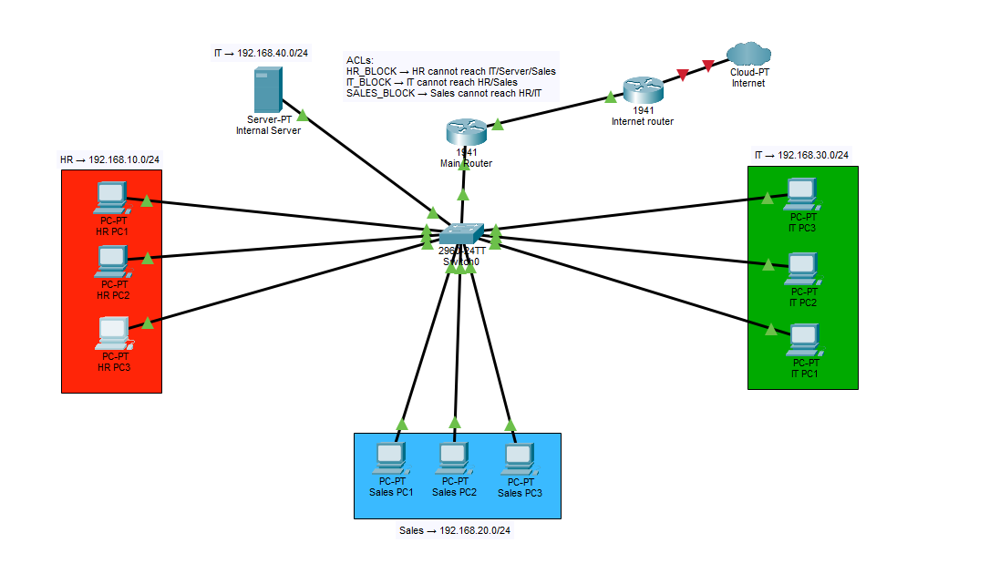
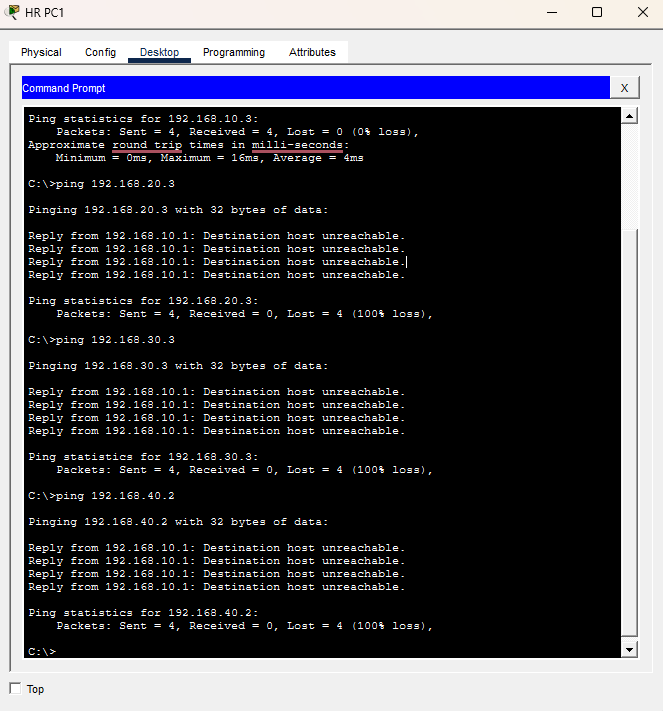
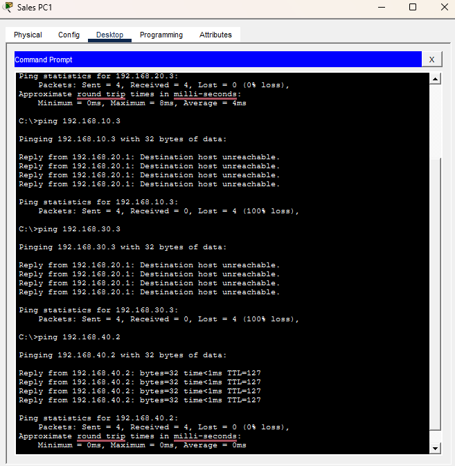
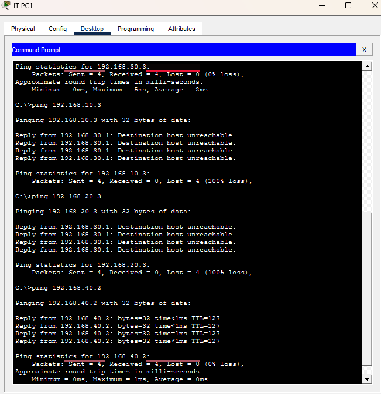

# Network Segmentation Security Lab (Cisco Packet Tracer)

## Project Overview

This project simulates a small office network using Cisco Packet Tracer to demonstrate how network segmentation can be used to improve security.

The network contains three departments (HR, Sales, and IT) and an internal server. Each department is placed in a separate VLAN, and access between networks is controlled using Access Control Lists (ACLs).

The goal of the lab is to show how basic network design decisions can reduce the risk of lateral movement if a system in the network becomes compromised.

---

## Security Problem

In flat networks where all devices share the same broadcast domain, an attacker who gains access to one system can often move freely across the network.

This lab demonstrates how network segmentation can reduce that risk by:

- Separating departments into different VLANs
- Controlling inter-VLAN communication using ACLs
- Restricting which departments can access sensitive resources

---

## Network Architecture

The simulated network contains four subnets:

| Network | Department |
|------|------|
| 192.168.10.0/24 | HR |
| 192.168.20.0/24 | Sales |
| 192.168.30.0/24 | IT |
| 192.168.40.0/24 | Internal Server |

Each department connects to a Layer 2 switch, and inter-VLAN routing is handled by a router using subinterfaces.

---

## Network Segmentation Design

Each department operates within its own VLAN:

| VLAN | Department |
|-----|-----|
| VLAN 10 | HR |
| VLAN 20 | Sales |
| VLAN 30 | IT |
| VLAN 40 | Server Network |

This separation prevents devices from directly communicating at Layer 2.

All communication between VLANs must pass through the router.

---

## Access Control Policy (ACLs)

Access Control Lists were configured to enforce the following rules:

- HR cannot access Sales, IT, or the Server
- Sales cannot access HR or IT
- IT cannot access HR or Sales
- Sales and IT are allowed to access the Server

This design simulates how organizations restrict communication between departments while allowing access to shared infrastructure.

---

## Project Structure

---

## Screenshots

### Network Topology

### HR Access Restricted

### Sales Access to Server

### IT Access to Server

---

## Security Concepts Demonstrated

- Network segmentation
- VLAN isolation
- Inter-VLAN routing
- Access Control Lists (ACLs)
- Basic internal network access control
- Limiting lateral movement inside a network

---

## What I Learned

This project helped reinforce several networking and security concepts:

- How VLANs can separate departments within the same physical network
- How routers enable communication between VLANs
- How ACLs can be used to enforce security boundaries between networks
- The importance of testing network policies using tools such as ping and connectivity checks

It also required troubleshooting connectivity issues while verifying that the access rules behaved as expected.
